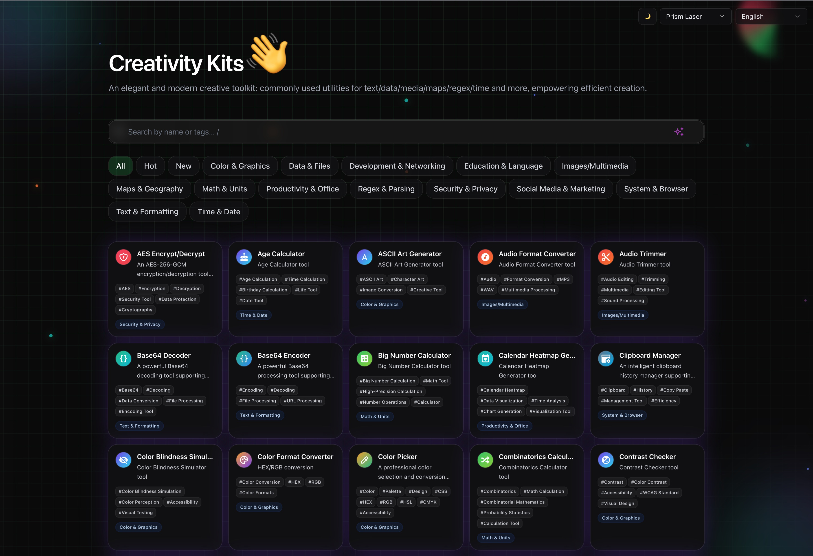
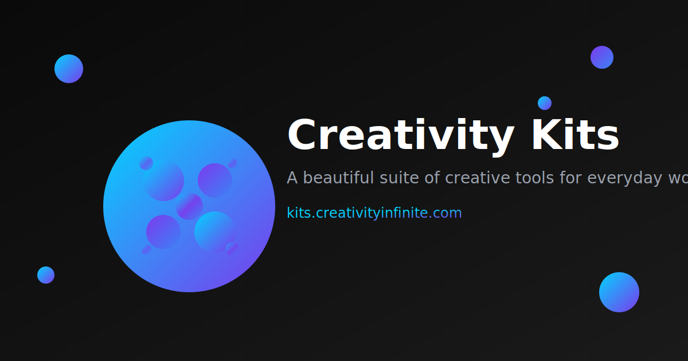

# Creativity Kits · 100+ Nuxt 3 Bento Grid Tool Suite

[English] · [简体中文](./README.zh-CN.md) · [繁體中文](./README.zh-TW.md)

A beautiful, performant, and extensible collection of 100+ micro tools built with Nuxt 3 + Vue 3 + Tailwind CSS + tailwindcss-animate. Designed as a Bento Grid with fluid transitions, dark/light theme, responsive layout, i18n (en/zh-CN/zh-TW), and client-side tool micro-components (no full-page refresh).

Tech stack: Nuxt 3, Vue 3, Tailwind CSS, tailwindcss-animate

- Live design reference: https://www.zhangyu.dev/
- Visual style: Bento Grid, light micro-animations, soft glows, and tasteful depth
- Core: Tool cards are dynamic-imported client components; switching tabs and filters uses FLIP/TransitionGroup for smooth layout transitions

Badges:
- Nuxt 3 · Vue 3 · Tailwind CSS
- CI/Lint/Test ready (Vitest, Playwright suggestion)
- Docker + Railway deploy

Note: This repository already contains SSR configuration, i18n (en/zh-CN/zh-TW), color mode, Tailwind dark mode (class), RailWay.toml, Dockerfile, and a working index Bento grid.

Screenshots / Hero Gallery (placeholders)
- Replace these placeholders with your actual screenshots or a product hero image
- Suggested: tools grid (light/dark), tab transition, search, individual tool modal or detail

GitHub Widgets
- Replace OWNER/REPO and USERNAME placeholders to enable dynamic widgets

- Star History (trend)
  - Date mode:  
    https://api.star-history.com/svg?repos=OWNER/REPO&type=Date
  - Embedded badge:  
    

- Repo Stats Card
  - 

- Streak & Overall Stats
  - 
  - 

- Contributors (all-contributors style or contrib.rocks)
  - 

Features
- 100+ tools across 14 categories (text, regex, time/date, color/graphics, images/media, dev/network, data/files, security/privacy, math/units, productivity, social/marketing, education/language, map/geo, system/browser)
- Bento Grid responsive design: elegant asymmetry, rhythm with size spans, clean spacing, and light effects
- Smooth FLIP transitions for card reflow; tailwindcss-animate for micro-interactions
- Dark/Light theme with @nuxtjs/color-mode and Tailwind dark class strategy
- i18n using @nuxtjs/i18n with language switcher (en/zh-CN/zh-TW)
- Client micro-components for each tool (SSR page remains, tool runs in its own card without full-page refresh)
- Tool discovery with tabs (All/Hot/New/Category) + fuzzy search over names/tags
- Strong project hygiene: ESLint, Prettier, Vitest, Dockerfile, Railway.toml
- AI-ready metadata-driven scaffolding concept for rapid tool creation

Project Structure (key parts)
- app.vue: Global switches (theme, theme style, language), Nuxt page wrapper
- pages/index.vue: The Bento Grid home with tabs, search, and animated TransitionGroup
- components/: Tabs, ToolCard, BackToTop, switches, and UI primitives
- tools/: Each tool has its own folder with Component.vue and meta.ts
- i18n/locales/: en.json, zh-CN.json, zh-TW.json
- tailwind.config.ts: darkMode class, theme extensions, tailwindcss-animate
- nuxt.config.ts: modules, i18n setup, color mode, head meta/OG/Twitter, postcss, runtimeConfig
- Railway.toml + Dockerfile: Production deploy ready
- vitest.config.ts: Unit test runner config
- scripts/: i18n/tag normalization helpers (note: new-tool scaffold placeholder, see below)

Quickstart

Requirements
- Node.js 20+
- PNPM/NPM/Yarn (examples use npm)

Install & Dev
- npm ci
- npm run dev
- Open http://localhost:3000

Build & Start (SSR)
- npm run build
- npm run start

Static Generate
- npm run generate

Lint & Format
- npm run lint
- npm run lint:fix
- npm run format
- npm run format:check

Tests
- npm run test
- npm run test:watch
- Playwright E2E suggested; see example workflow below

Environment Variables
- Copy to .env (or use Railway dashboard)

Example .env
- NUXT_PUBLIC_APP_NAME="Creativity Kits"

i18n
- Default locale: zh-CN
- Locales loaded from i18n/locales with strategy=no_prefix
- Language switcher component is visible at top-right

Theme
- @nuxtjs/color-mode configured in nuxt.config.ts
- Tailwind darkMode: 'class'
- Custom palettes in tailwind.config.ts with accent glows

Bento Grid & Animations
- TransitionGroup with FLIP-like reflow (grid-* transitions in pages/index.vue)
- Decorative yet subtle background layers via assets/css/animations.css
- Card hover/enter transitions with tailwindcss-animate and utility classes

Tool Architecture
- Every tool is a micro client component: tools/.../Component.vue + meta.ts
- Dynamic import and client-side execution (no full-page refresh)
- Tool metadata includes id, name, description, tags, category for filtering/i18n
- Example categories include:
  - text-format, regex-parse, time-date, color-graphics, image-media, dev-network, data-file, security-privacy, math-unit, productivity, social-marketing, education-language, map-geo, system-browser

Scaffolding (metadata-driven, AI-friendly)
- Intended command: npm run new:tool (points to scripts/new-tool.js)
- Current repository note: scripts/new-tool.js is not present yet. You can:
  - Create your own generator script at scripts/new-tool.js that:
    - Prompts for name/id/category
    - Creates tools/<category>/<id>/Component.vue and meta.ts
    - Inserts i18n stubs into i18n/locales/{en,zh-CN,zh-TW}.json
  - Or manually copy an existing tool folder as a template and adjust meta/i18n

CI/CD
- Suggested GitHub Actions (lint + test + build):

Example .github/workflows/ci.yml
- name: CI
  on:
    push:
      branches: [main]
    pull_request:
      branches: [main]
  jobs:
    build:
      runs-on: ubuntu-latest
      steps:
        - uses: actions/checkout@v4
        - uses: actions/setup-node@v4
          with:
            node-version: 20
            cache: npm
        - run: npm ci
        - run: npm run lint
        - run: npm run test
        - run: npm run build

Deploy to Railway

One-click via Dockerfile
- Repo includes Dockerfile and Railway.toml
- Steps:
  1) Create a new project in Railway
  2) Connect your GitHub repo
  3) Railway will use Dockerfile (builder = dockerfile per Railway.toml)
  4) Set envs (NUXT_PUBLIC_APP_NAME, etc.)
  5) Deploy; service listens on port 3000

Dockerfile overview
- Multi-stage build with node:20-alpine
- Builds Nuxt to .output
- Production image installs prod deps (npm ci --omit=dev)
- CMD ["node", ".output/server/index.mjs"]

Performance & Accessibility
- Lightweight CSS with Tailwind; animations are subtle and interruptible
- Accessibility considerations: color contrast checker tool is included; dark mode friendly; motion kept tasteful

Testing
- Vitest config provided (tests/**/*.test.ts)
- Playwright is included as a dev dependency; consider adding a basic smoke test:
  - Home loads and renders at least N cards
  - Tab change animates and filters tool list
  - Language switch changes visible labels

Contributing
- Fork, create a feature branch, commit following conventional style, open PR
- Add new tools in tools/<category>/<tool-id> with Component.vue + meta.ts
- Update i18n titles/descriptions/tags in all locales

Roadmap Ideas
- Add tool usage analytics (privacy-friendly)
- Add offline bundles for selected media/ffmpeg.wasm tools with lazy loading
- Enhance scaffold to auto-generate tests and Storybook stories for tools
- Theming presets gallery (coolBlue / cyberPurple / prismLaser already mapped)

License
- MIT

Attributions
- Icons via @iconify/vue
- Time/date via dayjs
- i18n via @nuxtjs/i18n
- Animations via tailwindcss-animate

Replace placeholders
- OWNER/REPO, USERNAME in badges/widgets
- Add actual screenshots under public/ and replace the placeholder images above